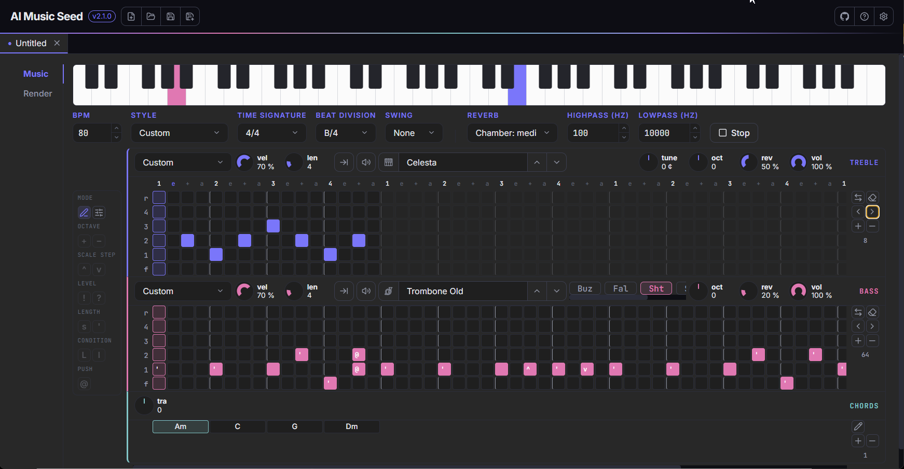

<p align="center">
  
</p>

<h1 align="center">AI Music Seed</h1>

<div align="center">
  <strong>Harmony your AI generator can actually hear.</strong><br>
  Turn a chord progression into an audio seed (plus MIDI) that Suno follows instead of inventing its own.
</div>

<br>

<!-- readme:nav -->

<div align="center">
  <a href="../../releases/latest"></a>
  <a href="../../releases"></a>
</div>

<h3 align="center">
  <a href="https://apps.yaiol.com/en/p/ai-music-seed/">Website</a>
  <span>&nbsp;·&nbsp;</span>
  <a href="#install">Install</a>
  <span>&nbsp;·&nbsp;</span>
  <a href="#what-it-is">Features</a>
  <span>&nbsp;·&nbsp;</span>
  <a href="#documentation">Documentation</a>
  <span>&nbsp;·&nbsp;</span>
  <a href="#build-from-source">Development</a>
</h3>

<div align="center">
  <sub><a href="https://apps.yaiol.com/en/p/ai-music-seed/help/"><b>Help in 28 languages</b></a></sub>
</div>

<!-- /readme:nav -->

---

<p align="center">
  
</p>

---

## Install

| Windows | macOS | Linux |
|:---:|:---:|:---:|
| [](../../releases/latest) | [](../../releases/latest) | [](../../releases/latest) |
| x64 installer | Intel and Apple Silicon | portable AppImage |

> **Windows note:** SmartScreen may warn on first launch because the app is not code-signed. Click "More info", then "Run anyway".

---

## What it is

AI music generators like Suno don't read chord names typed into a prompt - they only follow harmony they can *hear*. AI Music Seed renders a chord progression to a short audio **seed** (plus a MIDI file) that you upload as a Cover or Extend, so the generator locks to your harmony instead of inventing its own.

It's a focused, single-purpose desktop app: type a progression, pick a texture and an instrument, render, upload.

---

## Features

- **Harmony Suno can hear** - renders your chord progression to an audio seed you upload as a Cover or Extend, so the generator locks to your harmony instead of inventing its own.
- **Write real chords** - a full vocabulary: triads through 13ths, suspended, diminished and augmented chords, slash-bass, and rests.
- **Four seed textures** - pad, arp, drone or marker - choose how present the seed is, from a full harmonic bed to a near-silent skeleton that nudges without colouring.
- **Sixteen rhythms** - or give the seed a groove instead: backbeat, four-on-the-floor, rock, funk, bossa nova, reggae, ballad, strum, waltz, and arpeggios that move through the chord rather than restating it - so the generator has a tempo to lock onto and not just harmony.
- **Twelve instruments** - play any texture on the built-in synth or on a sampled grand piano, electric piano, organ, guitar, harp, strings, choir, pad or marimba, from a bundled General MIDI SoundFont.
- **MP3 or WAV** - export a small MP3 (selectable bitrate, the default for almost every upload) or an uncompressed WAV when you want the raw audio.
- **Play it live** - hit Play and the seed loops instantly, with nothing written to disk. Change the chords, the style, the instrument or the tempo while it plays and you hear it on the next chord - no stopping, no restarting.
- **MIDI alongside** - every render also saves a MIDI of the progression, ready to drop into your DAW.

---

## Documentation

| | |
|---|---|
| **User manual** | [Read it online](https://apps.yaiol.com/en/p/ai-music-seed/help/) |
| **Printable PDF** | attached to each [release](../../releases/latest) |
| **What's new** | [Release notes](https://apps.yaiol.com/en/p/ai-music-seed/help/releases/) |
| **Product page** | [apps.yaiol.com](https://apps.yaiol.com/en/p/ai-music-seed/) |

---

## Build from source

```bash
npm install
npm run electron:dev   # React + Electron together (dev)
npm run dist           # Windows x64 installer
```

Requires Node.js 20+.

---

## Architecture

A React front-end talks to an Electron + Express back-end over a local HTTP API - the standard yaiol Electron shape. There is no database and no seed persistence: the app opens with a single blank seed each launch, and a seed is kept by saving it to a `.yams`. It is **multi-document** - several `.yams` seeds are open at once, one per tab, like markzen with `.md`.

| Layer | Technology |
|---|---|
| UI framework | React 19 |
| Bundler | Vite 8 |
| Desktop shell | Electron 41 |
| Local API | Express 5 |
| Audio synthesis / MIDI | in-house `seed-engine.js` |
| Sampled instruments | compiled sample packs (`public/packs/`); in-house `soundfont.js` can load an `.sf3`/`.sf2` bank (none bundled) |
| MP3 encoding | `@breezystack/lamejs` |
| Packaging | Electron Builder |

<details>
<summary><b>Components</b></summary>

| Layer | What it does |
|---|---|
| React UI (`src/`) | Tabbed multi-document shell (`App`) around one seed-generator form per tab (`SeedPanel`) - name, progression, BPM, bars, time signature, loops, texture, audio format + bitrate, output template. A seed is saved as a `.yams`; rendering writes the audio + MIDI into that file's folder. |
| Seed engine (`src/lib/seed-engine.js`) | Pure JS, runs in the renderer. Turns each chord into note events (the *gesture*), voices them with either the built-in synth or a sampled instrument (the *timbre*), then encodes either a 16-bit mono WAV or a mono MP3 (via lamejs), and writes a type-0 MIDI. |
| Live player (`src/lib/seed-player.js`) | Playback through Web Audio. Where the engine *computes* samples to produce a file, this *schedules* notes on the audio thread and materialises nothing - which is why it starts instantly. It is a look-ahead scheduler that re-reads the seed at every chord boundary, so chords, style, instrument and tempo can all be changed while it plays. It uses the same gestures and the same SoundFont data as the exporter, so what you hear cannot drift from what gets written. |
| SoundFont reader (`src/lib/soundfont.js`) | Can read an SF3/SF2 bank (none bundled) - preset/instrument/zone resolution, key + velocity ranges, tuning, loop points and the volume envelope - and renders a note from the matching sample. Also hosts the generic voice renderer the compiled packs play through. |
| Express back-end (`electron/main.mjs`) | Local HTTP API on a dynamic port (from 4000). Saves/loads `.yams` files via native dialogs, writes the rendered audio + MIDI to disk (into the seed's `.yams` folder), and reveals files in the OS file manager. |

</details>

<details>
<summary><b>How a seed is made</b></summary>

The seed engine started as a JS port of a Python prototype (`chord-seed.py`); the chord vocabulary, render styles and encoders match it, but the **timing model now leads on the JS side**. Each form control maps to an engine param:

| Prototype flag | Form control | Engine param |
|---|---|---|
| `progression` | multi-line textarea | `progression` |
| `--bpm` | number | `bpm` |
| `--bars` | number (0.25 step), "Bars per **line**" | `bars` |
| `--sig` | text (`4/4`, `3/4`, `6/8`...) | `sig` |
| `--loops` | number | `loops` |
| `--style` | select (4 textures + 16 rhythms) | `style` |
| *(none)* | select (instrument) | `instrument` |
| `--format` | select (mp3 / wav) + bitrate | `format`, `mp3Bitrate` |
| `--name` | **Output** — text (a token template) | save filename |
| *(none)* | **Name** — text, above every other field | `name` (metadata; feeds `{name}`) |

The prototype's `--outdir` flag has no form control: the output folder is the folder the seed's `.yams` lives in, so a seed must be **saved** before it can render (the Render button is disabled until then).

**Name vs Output — two different things.** *Name* is what the seed is called; *Output* is what the rendered files are called. Output is a template resolved at render time: `{name}` (the seed name, file-name-sanitised, falling back to `{chords}` when the seed is unnamed), `{chords}` (a base name from the **first 8** chords — capped so a full song chart can't produce a 200-character filename), `{style}`, `{instrument}`, `{bpm}`, `{loops}`. A new seed starts at **`{name}-{style}-{bpm}`**, and that is also what a `.yams` without an `output` field falls back to — the field is never blank-with-hidden-behaviour.

**Timing — line = bar.** The progression is read line by line: each non-blank line is one timing unit of `bars` bars, and the chords on that line **split it evenly** (four chords on a line = a beat each in 4/4; a chord alone on a line holds the whole bar). `[Section]` headers, blank lines and `|` bar marks are stripped, so a chord chart pastes in almost verbatim. `parseLines` → `planEvents` build the timed event list, shared by `generateSeed` (render) and `analyzeSeed` (the render-free size/duration projection shown live under the form).

Supported chords: triads, sixths, sevenths and extensions (`maj7` / `m7` / `7` / `9` / `11` / `13` and their minor/major forms), `sus2` / `sus4`, `dim` / `dim7` / `m7b5`, `aug`, `add9`, slash bass (`D/E`, `Bm/F#`), and rests (`N.C.` / `N.C./B`). Anything the parser doesn't recognise falls back to a major triad on that root, so a typo never crashes the render. Filenames are NTFS-sanitised; the engine writes the audio (MP3 or WAV) alongside a type-0 MIDI of the same progression.

</details>

---

## License

Released under the [MIT License](LICENSE).

### Third-party

The sampled instruments are compiled from freely-licensed sample libraries (CC0 and CC BY); each compiled pack's attribution (author, licence, source) is recorded with it.

<div align="center">
  <sub>AI Music Seed is part of <a href="https://apps.yaiol.com">yaiol Applications</a>.</sub>
</div>
